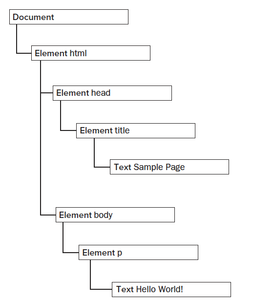

[toc]

# Document Object Model

（ *Professional Javascript for Web Developer， 3rd Edition* -- Chapter 10 )

## Nodes的层级

HTML文件中包含着多种类型的节点，节点之间的关系构成了一种树状的层级。例如一段最简单的HTML代码：

```html
	<html>
		<head>
			<title>Sample Page</title>
		</head>
		<body>
			<p>Hello World!</p>
		</body>
	</html>
```
这段简单代码的结构可以用下图来表示，每个标记都可以表示为DOM树上的一个节点：



## Node

每一个Node都包含一个`nodeType`属性，用以表示Node的类型。`nodeType`的值为整数1-12，用以表示12种Node类型，Node类型和整数的对应关系如下：

* Node.ELEMENT_NODE (1)
* Node.ATTRIBUTE_NODE (2)
* Node.TEXT_NODES (3)
* Node.CDATA\_SECTION_NODE (4)
* Node.ENTITY\_REFERENCE_NODE (5)
* Node.ENTITY_NODE (6)
* Node.PROCESSING\_INSTRUCTION_NODE (7)
* Node.COMMENT_NODE (8)
* Node.DOCUMENT_NODE (9)
* Node.DOCUMENT\_TYPE_NODE (10)
* Node.DOCUMENT\_FRAGMENT_NODE (11)
* Node.NOTATION_NODE (12)

判断一个Node的类型可使用如下方法：

```js
	if (someNode.nodeType == Node.ELEMENT_NODE) {    //won't work in IE < 9
		alert("Node is an element")
	}
	
	//OR
	
	if (someNode.nodeType == 1) {    //works in all browsers
		alert("Node is an element")
	}
```

### nodeName 和 nodeValue属性

这两个属性和Node的类型相关，对于**element**, `nodeName`等于**标签名称**，`nodeValue`等于**null**

### Node间的关系

文件中的每一个Node之间都有着相互关系，例如在HTML中，<body>元素是<html>元素的子元素，是<head>元素的兄弟元素。

每一个Node都包含一个`childNodes`属性，其中包含了一个**NodeList**, **NodeList**是一个**array-like**的对象，其中按顺序储存了一个节点列表。**要特别注意，NodeList并不是数组的实例，虽然其中的元素可以通过中括号来访问。**

访问**NodeList**中的节点有如下两种方式：

```js
	var firstChild = someNode.childNodes[0];
	var secondChild = someNode.childNodes.item(1);
	var count = someNode.childNodes.length;
```

**注意IE9之前的IE浏览器不会为white space创建节点，而其他浏览器会创建。**因此childNodes的长度会因浏览器而异。

通过如下代码可以将**NodeList**转换为真正的数组(不支持IE9以下)：

```js
	var arrayOfNodes = Array.prototype.slice.call(someNode.childNodes, 0);
```

此外，每一个Node还有一个`parentNode`属性，用以指向其DOM树中的父元素。同一级的**NodeList**中的节点可以通过`previousSibling`和`nextSibling`属性来获取。一个**NodeList**中第一个元素的`previousSibling`和最后一个元素的`nextSibling`属性都为`null`。通过调用`hasChildNodes()`方法可以用来判断一个节点是否包含子节点。

节点之间的关系可用下图来概括：


### Node的操作

以下方法均作用于某个节点的各子节点：

* `someNode.appendChild(newNode)`, 在`childNodes`的最后添加一个节点，并返回新添加的节点。
* `someNode.insertBefore(newNode, someChildNode)`, 在节点之前添加一个新节点。
* `someNode.replaceChild(newNode, someChildNode)`, 用新节点替换某个节点。
* `someNode.removeChild(someChildNode)`, 删除某个节点。

### 两个通用的方法

* `someNode.cloneNode(booleen)`, 节点调用该方法可以返回一个该节点的克隆，当传入`false`时，仅克隆该节点，传入`true`时会深度克隆该节点的所有子节点：
	
	```html
		<ul>
			<li>item 1</li>
			<li>item 2</li>
			<li>item 3</li>
		</ul>
	```

	```js
		var deepList = myList.cloneNode(true);
		alert(deepList.childNodes.length);  //3 (IE < 9) or 7 (others)
		
		var shallowList = myList.cloneNode(false);
		alert(shallowList.childNodes.length);  //0
	```
	**注意该方法不会复制通过javascript添加到DOM元素上的属性，例如事件监听器。其仅仅复制了DOM元素的attribute和子节点**
	
* `someNode.normalize()`，用以处理**text nodes**，当调用时，删除该节点后代中内容为空的**text nodes**，并将相邻的**text nodes**合并。	

## Document

Javascript通过`Document`类型来代表document节点。在浏览器中，`document`对象是`HTMLDocument`的一个实例（其继承自`Document`，代表整个HTML页面）。`document`对象是`window`对象的一个属性，因此可以全局访问。`Document`节点有如下性质：

* `nodeType` is 9.
* `nodeName` is `#document`.
* `nodeValue` is `null`.
* `parentNode` is `null`.
* `ownerDocument` is `null`.
* 子节点可能是一个`DocumentType`(至多一个)，一个`Element`(至多一个），`ProcessingInstruction`或者`Comment`

### Document的子节点

#### 获取子节点
有两种方式可以快速访问`Document`节点的子节点，其一是通过`documentElement`属性，可直接指向HTML文件中的`<html>`元素，其二是通过`childNodes`。例如下面的简单页面：

```html
	<html>
		<body>
		
		</body>
	</html>
```

```js
	var html = document.documentElement;     //get reference to <html>
	alert(html === document.childNodes[0]);  //true
	alert(html === document.firstChild);     //true
```

这个例子中`documentElement`，`childNodes[0]`，`firstChild`是一样的，都指向了`<html>`元素，因为此时`document`只有这一个子节点。

#### document.body
作为`HTMLDocument`的一个实例，`document`对象具有一个`body`属性，直接指向`<body>`元素。

#### document.doctype

`<!DOCTYPE>`可以通过`document.doctype`来获取，不过不同浏览器对这个属性的支持有所不同：

* **Internet Explorer 8 and earlier** -- `<!DOCTYPE>`会被错误地当做一个`Comment`来解析，因此`document.doctype`为`null`.
* **Internet Explorer 9+ and Firefox** -- `document.doctype`是一个`DocumentType`节点，其等价于`document.firstChild`和`document.childNodes[0]`.
* **Safari, Chrome, and Opera** -- `document.doctype`仍然被处理为`DocumentType`节点，但是其不出现在`document.childNodes`中。

#### comment

理论上来件，注释应该是`document`的子节点。不过不同浏览器对注释的处理有很大不同，例如下面一个HTML页面：

```html
	<!-- first comment -->
	<html>
		<body>
		</body>
	</html>
	<!-- second comment -->
```

* **Internet Explorer 8 and earlier, Safari 3.1 and later, Opera and Chrome**会为第一条注释创建一个`comment`节点，但是不为第二条注释创建，因此第一条注释会称为`document.childNodes`的第一个元素。
* **Internet Explorer 9 and later**会为第一条注释创建一个`comment`节点，作为`document.childNodes`的元素，同时为第二条注释创建一个`comment`节点，作为`document.body.childNodes`的元素。
* **Firefox**和**Safari prior to 3.1**会忽略这两条注释。

**一般来说，`document`不会调用`appendChild()`, `removeChild()`, `replaceChild()`方法，因为`document`类型是只读的，并且只能有一个子节点。**

### Document信息

`document`对象作为`HTMLDocument`的实例，具有一些`Document`对象没有的属性。这些属性包含了当前加载页面的信息:

* `document.title`
* `document.url`
* `document.domain`
* `document.referrer`

### 获取元素

* `document.getElementById`
* `document.getElementsByTagName`
* ...

### 获取特定种类元素

* `document.anchors`
* `document.applets`
* `document.forms`
* `document.images`
* `document.links`


### Document Writting

通过`document.write()`可以向HTML页面中写入内容，通常被用来引入外部文件例如javascript文件。此时应注意结尾标签的写法，不然会导致无法执行。

```html
	<html>
	<head>
		<title>document.write() Example</title>
	</head>
	
	<body>
		<script type="text/javascript">
			document.write("<script type=\"text/javascript\" scr=\"file.js\">" + "<\/script>");
		</script>
	</body>
	
	</html>
```

这个例子中`document.write()`是在页面加载过程中执行的，**注意如果页面加载完成后执行`document.write()`会导致页面重新渲染！**

## Element

`element`是web开发中最常见的节点类型，其有如下性质：

* `nodeType` 是 1。
* `nodeName` 是元素的标签名称。
* `nodeValue` 是 `null`。
* `parentNode` 是 `Document` 或者 `Element`。
* 子节点可能是`Element`, `Text`, `Comment`, `ProcessingInstruction`, `CDATASection`或者`EntityReference`

`element`的标签名称可以通过`nodeName`或者`tagName`来获取，注意获取的标签名称为**全大写！**（例如“DIV”）

### HTML Elements

`HTMLElement`是从`Element`继承而来的，但是添加了一些属性：

* `id`
* `title`
* `lang`
* `dir` -- 文字顺序，`ltr`或者`rtl`
* `className`

### Getting Attributes

`div.getAttribute(attributeName)`

or

`div.attributeName`

### Setting Attributes

`div.setAttribute(attributeName, attributeValue)`

or

`div.attributeName = attributeValue`

**注意attribute的名称是不区分大小写的，而且IE8之后的浏览器不支持自定义的名称**

### attributes 属性

`Element`具有一个`attributes`属性，其中包含了一个`NameNodeMap`对象。`NameNodeMap`类似于`NodeList`，所有元素的`attribute`都保存为其中的节点。每个节点的`nodeName`和`nodeValue`分别是这个这个`atrtibute`的名称和值。

这个`NameNodeMap`对象具有如下几个方法：

* `getNamedItem(name)` -- 获取`nodeName`为**name**的节点
* `removeNamedItem(name)` -- 删除`nodeName`为**name**的节点
* `setNamedItem(node)` -- 添加一个节点
* `item(pos)` -- 返回某个位置上的节点

### 创建Elements

`document.createElement(tagName)`

### 遍历Element的子元素

```html
	<ul id="myList">
		<li>item 1</li>
		<li>item 2</li>
		<li>item 3</li>
	</ul>
```
除了IE8以及更早的IE浏览器，其他浏览器中`<ul>`元素被认为有**七个**子节点 -- 三个`element`节点和四个`text`节点（代表元素间的空格），因此当遍历元素的子节点时，需要检验`nodeType`:

```js
	for var i=0; i<element.childNodes.length; i++ {
		if (element.childNodes[i].nodeType == 1) {
			//do processing
		}
	}
```

当`<ul>`只包含一层子节点时，也可以采用如下方法：

```js
	var ul = document.getElementById("myList");
	var items = ul.getElementByTagName;
```


## Text

`Text`节点具有如下特点：

* `nodeType` 是 3
* `nodeName` 是 ”#text“
* `nodeValue` 是节点中包含的文本内容
* `parentNode` 是一个`Element`
* 不支持`Child nodes`

节点中包含的文本内容既可以通过`nodeValue`也可以通过`data`来获取，以下几个方法可以用来操作节点中的文本内容：

* `appendData(text)` -- 在节点的末尾添加文本
* `deleteData(offset, count)` -- 从**offset**位置开始删除**count**个字符的文本
* `insertData(offset, text)` -- 在**offset**处插入文本**text**
* `replaceData(offset, count, text)` -- 将从**offset**位置开始的**count**个字符替换为**text**
* `splitText(offset)` -- 将文本从**text**位置分为两段
* `substringData(offset, count)` -- 将从**offset**位置开始的**count**个字符提取出来

### 改变`text`节点中的内容：

```js
	div.firstChild.nodeValue = "Some <strong>other</strong> message"
```

**改变text节点时所使用的字符串中的所有HTML标签都是escaped**


### 元素中添加`text`节点：

```js
	var element = document.createElement("div");
	element.className = "message";
	
	var textNode = document.createTextNode("Hello world");
	element.appendChild(textNode);
	
	document.body.appendChild(element);
```

### Normalizing Text Nodes

`element`节点具有一个`normalize()`方法，用以合并子元素中相邻的`text`节点


```js
	var element = document.createElement("div");
	element.className = "message";
	
	var textNode = document.createTextNode("Hello world!");
	element.appendChild(textNode);
	
	var anotherTextNode = document.createTextNode("Yippee!");
	element.appendChild(anotherTextNode);
	
	document.body.appendChild(element);
	
	alert(element.childNodes.length); //2
	
	element.normalize();
	alert(element.childNodes.length); //1
	alert(element/firstChild.nodeValue); //"Hello world!Yippee"
	
```


### Splitting Text Nodes

```js
	var element = document.createElement("div");
	element.className = "message";
	
	var textNode = document.createTextNode("Hello world!");
	element.appendChild(textNode);
	
	document.body.appendChild(element);
	
	var newNode = element.firstChild.splitText(5);
	alert(element.firstChild.nodeValue);  //"Hello"
	alert(newNode.nodeValue); //" world!"
	alert(element.childNodes.length);  //2
```

## Comment

**待完成**

## CDATASection

**待完成**

## DocumentFragment

**待完成**

## Attr

**待完成**

## 动态加载脚本

###动态加载脚本文件

```js
	function loadScript(url) {
		var script = document.createElement("script");
		script.type = "text/javascript";
		script.src = url;
		document.body.appendChild(script);
	}
	
	loadScript("script.js");
```

###动态加载脚本字符串

```js
	function loadScriptString(code) {
		var script = document.createElement("script");
		script.type = "text/javascript";
		try {
			script.appendChild(document.createTextNode(code));
		} catch (ex) {
			script.text = code;
		}
		document.body.appendChild(script);
	};
	
	loadScriptString("function sayHi() {alert('hi');}")
```

## 动态加载css样式

### 动态加载样式文件

```js
	function loadStyles(url) {
		var link = document.createElement("link");
		link.rel = "stylesheet"
		link.type = "text/css";
		link.href = url;
		var head = document.getElementsByTagName("head")[0];
		head.appendChild(link);
	}
	
	loadStyles("styles.css");
```

### 动态加载样式字符串

```js
	function loadStyleString(css) {
		var style = document.createElement("style");
		style.type = "text/css";
		try {
			style.appendChild(document.createTextNode(css))
		} catch (ex) {
			style.styleSheet.cssText = css;
		}
		var head = document.getElementsByTagName("head")[0];
		head.appendChild(style);
	}
	
	loadStyleString("body{background-color: red}");
```

## Table

**待完成**

## 使用NodeList

`NodeList`对象及其相关的`NamedNodeMap`和`HTMLCollection`都是动态的，也就是说它们会随着文档结构的改变而实时改变。每次访问`NodeList`都是访问它的最新状态。例如下面的代码是无限循环的：

```js
	var divs = document.getElementByTagName("div"),
		i,
		div;
		
	for (i=0; i < divs.length; i++) {
		div = document.createElement("div");
		document.body.appendChild(div);
	}
```

应当修改如下：

```js
	var divs = document.getElementByTagName("div"),
		i,
		len,
		div;
		
	for (i=0, len=divs.length; i < len; i++) {
		div = document.createElement("div");
		document.body.appendChild(div);
	}
```

由于变量`len`在循环开始时就捕获了`divs.length`的值，在循环过程中不会改变，因此不会出现无限循环。